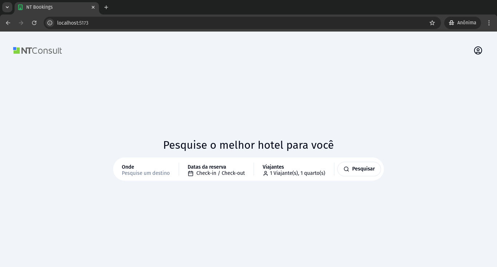
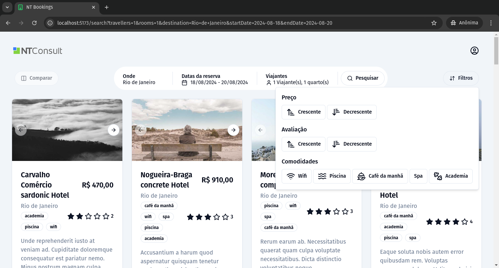
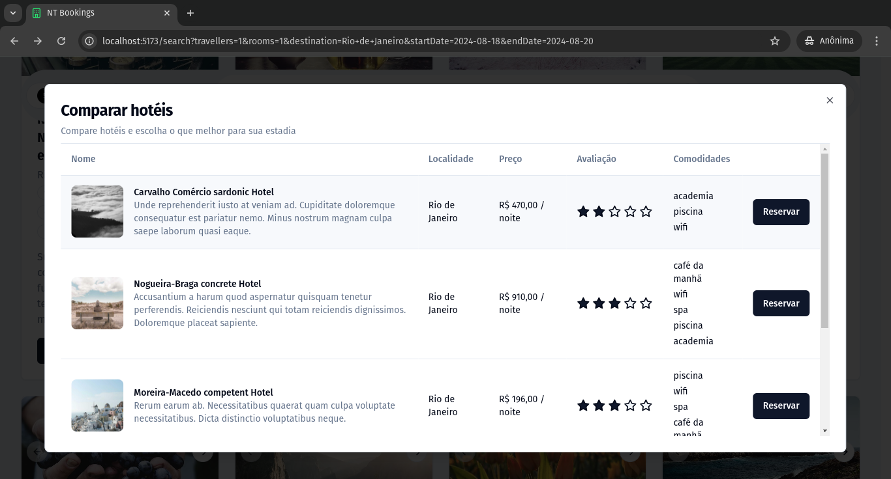
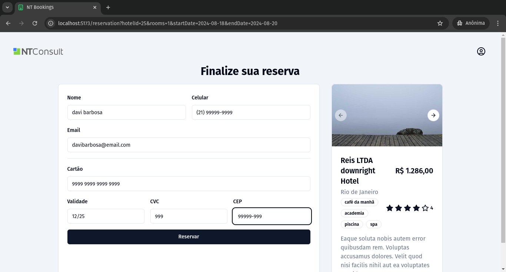
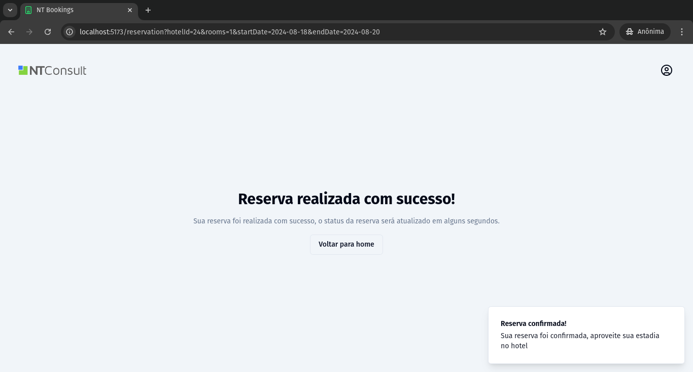

# Desafio front-end da NTConsult - Davi Barbosa

Projeto que permite a pesquisa de hotéis com critérios selecionados pelo usuário, filtragem, comparação e visualização de detalhes de cada hotel e formulário para reserva de um quarto

## Tecnologias utilizadas

- [Vue 3](https://vuejs.org/) - Framework JavaScript
- [TypeScript](https://www.typescriptlang.org/) - Superset de JavaScript que adiciona tipagem estática
- [Vue Router](https://router.vuejs.org/) - Gerenciador de rotas
- [Pinia](https://pinia.vuejs.org/) - Gerenciador de estado
- [Tailwind CSS](https://tailwindcss.com/) - Framework CSS
- [Vite](https://vitejs.dev/) - Ferramenta de build
- [Axios](https://axios-http.com/) - Cliente HTTP
- [Vuelidate](https://vuelidate.js.org/) - Validação de formulários
- [Radix/vue](https://www.shadcn-vue.com/) - Componentes acessíveis e customizáveis (shadcn-vue)
- [MirageJS](https://miragejs.com/) - Mock de API
- [Zod](https://zod.dev/) - Validação de dados
- [VueUse](https://vueuse.org/) - Biblioteca de hooks para Vue

## Iniciando o projeto

### Pré-requisitos

- Node.js (versão >= `20.10.0`)
- yarn (versão >= `1.22.22`)

### Instalação

1. Clone o repositório:
2. Navegue até o diretório do projeto: `cd teste-ntconsult`
3. Instale as dependências: `npm install` ou `yarn install`
4. Inicie o servidor de desenvolvimento: `npm run dev` ou `yarn dev`

5. Acesse `http://localhost:3000` no seu navegador para ver a aplicação.

## Estrutura do projeto

- `server.js`: Arquivo que configura o MirageJS para mock de API
- `src/components`: Componentes utilizados na aplicação
  - `src/components/ui`: Componentes de UI primitivos
- `src/Pages`: Páginas principais da aplicação que são mapeadas pelo Vue Router
- `src/containers`: Componentes que atuam como "containers", ou seja, contém lógica de negócio e estado
- `src/stores`: Stores que gerenciam o estado da aplicação
- `src/types`: Tipos utilizados na aplicação
- `src/utils`: Funções e módulos auxiliares

## Features

- Pesquisa de hotéis com critérios selecionados pelo usuário
- Filtragem de hotéis
- Comparação de hotéis
- Visualização de detalhes de cada hotel
- Formulário para reserva de um quarto
- Mock de API com MirageJS
- Validação de formulários com Vuelidate
- Gerenciamento de estado com Pinia
- Estilos globais com Tailwind CSS
- Componentes acessíveis e customizáveis com Radix/vue
- Estados persistidos na URL para facil compartilhamento e reutilização

## Arquitetura

- Componentes: Hierarquia de componentes Vue com fluxo de dados unidirecional
- Gerenciamento de estado: Utilização do Pinia para gerenciamento de estado global
- Integração com API: Mock de API usando MirageJS para simular endpoints
- Roteamento: Vue Router para navegação entre páginas
- Validação: Uso do Zod para validação de dados e formulários

## Imagens do projeto

